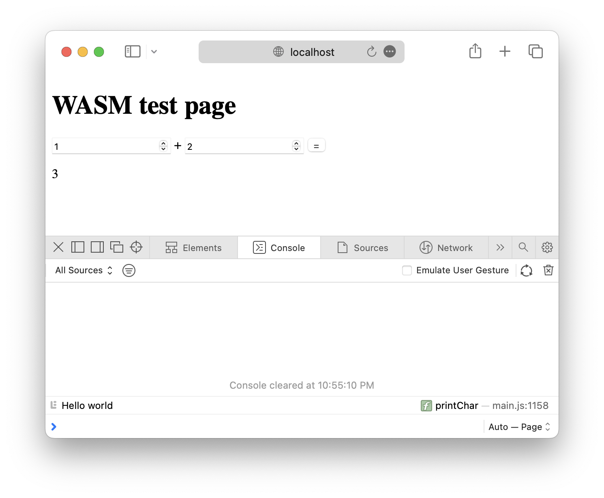

# WebAssembly with cmake and vcpkg template

_Gilbert Francois Duivesteijn_


## About

This is a template that can act as starting point to create a javascript web application, calling (library) functions in WebAssembly, made with the C programming language. The template uses:

- *cmake* for building your binaries
- *vcpkg* for C and C++ package management
- *emscripten* for compiling to wasm

```
.
├── 3rdparty
│   ├── emsdk [for compiling to web assembly]
│   └── vcpkg [for C package management]
├── CMakeLists.txt
├── dist      [built artefacts]
├── src
│   ├── cc    [C source files]
│   ├── html  [html source files]
│   └── ...
└── vcpkg.json [for C package management]
```


## First time project setup (macOS, Linux)

On Linux, run first:

```sh
sudo apt install -y nodejs cmake ninja-build gcc build-essential git zip unzip curl
```

If running on Linux ARM, set the environment variable:

```sh
export VCPKG_FORCE_SYSTEM_BINARIES=arm
```


Start here to setup the project:

```sh
# Clone the template.
git clone https://github.com/gilbertfrancois/wasm-cmake-vcpkg-template.git

cd emscripten-vcpkg-template

# Important! Clone and init subrepositories.
git submodule update --init --recursive

# Install the emscripten SDK.
./3rdparty/emsdk/emsdk install latest
```


## Compile C

```sh
cmake -S . -B build
cmake --build build
cmake --install build
```


## Compile WASM

```sh
# Activate the emscripten environment and set paths.
./3rdparty/emsdk/emsdk activate latest
source 3rdparty/emsdk/emsdk_env.sh

cmake -S . -B build -DWITH_WASM=true
cmake --build build
cmake --install build
```


## Test

To see the compiled output of the WebAssembly binary, run:

```
cd dist
python -m httpd.server
```

Open a browser: `http://localhost:8000`. The button triggers the ***int add(int a, int b)*** function, taking the inputs from the form.




## References

- [Emscripten with CMake](https://stunlock.gg/posts/emscripten_with_cmake/)

- [WebAssembly Tutorial](https://www.youtube.com/playlist?list=PLysLvOneEETPM_YbEyZcJ35_3pSdrj33O)
- [sdl-canvas-wasm minimal example](https://github.com/timhutton/sdl-canvas-wasm)
- [WebAssembly with SDL2 + sound](https://github.com/AlbertVeli/wasm_sdl2_test)


## Steps to make C code WASM compatible

- Adapt cmake
- Adapt the main loop and call [void emscripten_set_main_loop_arg(em_arg_callback_func func, void *arg, int fps, int simulate_infinite_loop)](https://emscripten.org/docs/api_reference/emscripten.h.html#c.emscripten_set_main_loop_arg)  when compiling for wasm. 
- 